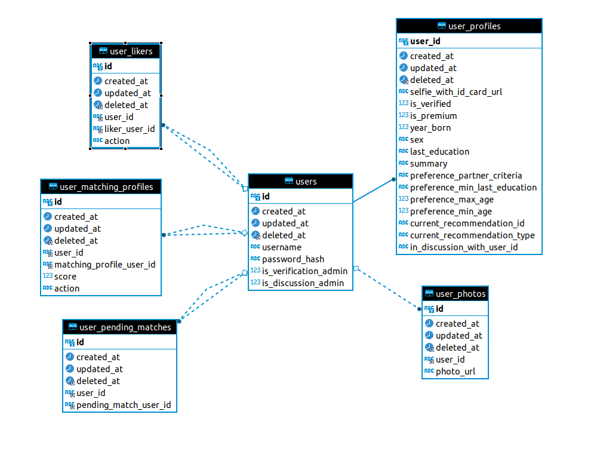

# Nafisa
Backend API for finding your lifetime partner. [Who is Nafisa?](https://en.wikipedia.org/wiki/Khadija_bint_Khuwaylid#Marriage_to_Muhammad)

## Features
- Authentication using username and password.
- User need to be verified first before viewing other user profiles.
- After being verified, the user profile will be indexed in Elasticsearch.
- The recommendation is based on the last education level, age, profile summary, and partner criteria that is stated by the user in signup form.
- We use [USE model](https://tfhub.dev/google/universal-sentence-encoder/4) to convert the user's profile summary and partner criteria to a vector. We then compute the cosine distance of these two vector to other user profile's summary to approximate the compatibility between the two user profiles.

## ERD


## Start The Server
```bash
docker compose up
```

## Generate Sample Data
There are 30 sample user profiles of males and females to test the flow in `generate_sample` folder. The `main.py` script creates 30 signup reqeusts for the sample profiles, crates new admin user, and use the new admin user to verify the 30 sample profiles. To run the script, make sure you have the `requests` library installed. You can install it with the following command.
```
pip3 install requests
```
Run this command to generate the sample data.
```bash
python3 generate_sample/main.py
```

## Postman Collections to Test Endpoints
[Link to Postman Collections](https://elements.getpostman.com/redirect?entityId=3737341-2aa47bbe-93b9-47f6-9143-d89eb19fd550&entityType=collection)
- After generating the sample data, you can try to login with a user account in the json file in the `generate_sample_data` folder. Use the `Login User` request in the `Auth` folder.
- If you use the `View` request in the `Recommendation` folder, you'll see an error response saying that the recommendation is not ready yet. You should use the `Match Profile` request first to generate the recommendation and then try to view the recommendation again.
- The `View` request will always return the same profile until you like or pass the profile.
- You can use the `Like` or `Pass` request to like or pass the current recommended profile. It does not need any request parameters. After that, the recommendation will be shifted to other user profiles. You can use the `View` request again to make sure you view a different profile than before.
- The sample data is written such that two profiles of the same order is similar to each other. For example, if you take the 2nd male sample profile -- if the recommendation performs well -- the first few recommendation should return the 2nd female sample profile. So far, the recommendation algorithm does not always immediately return the matching profile, it might need some more tweaks to be improved.
